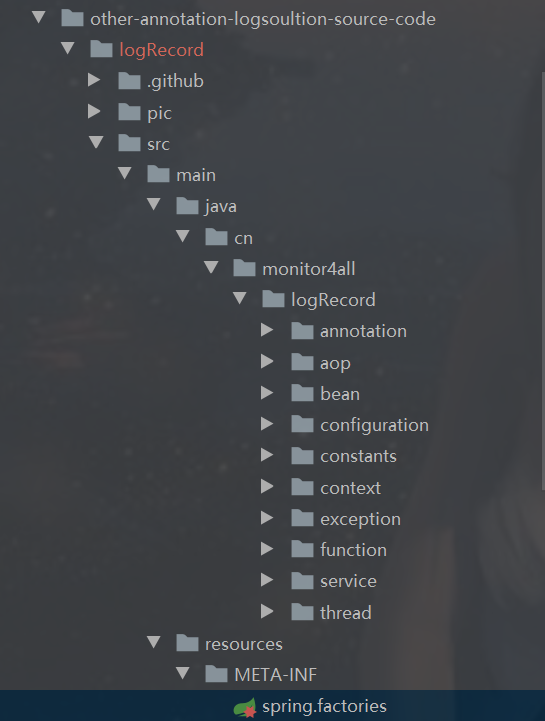
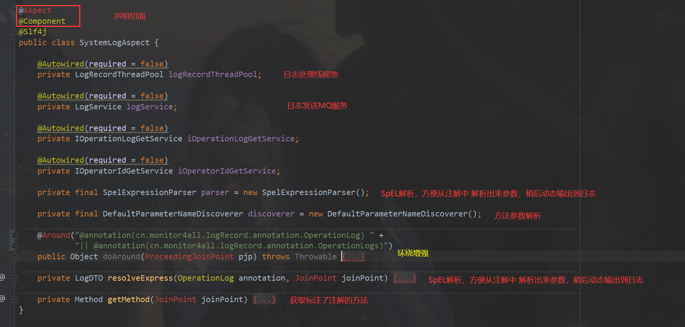
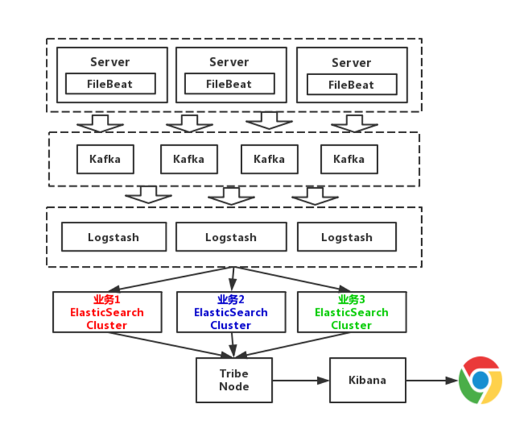
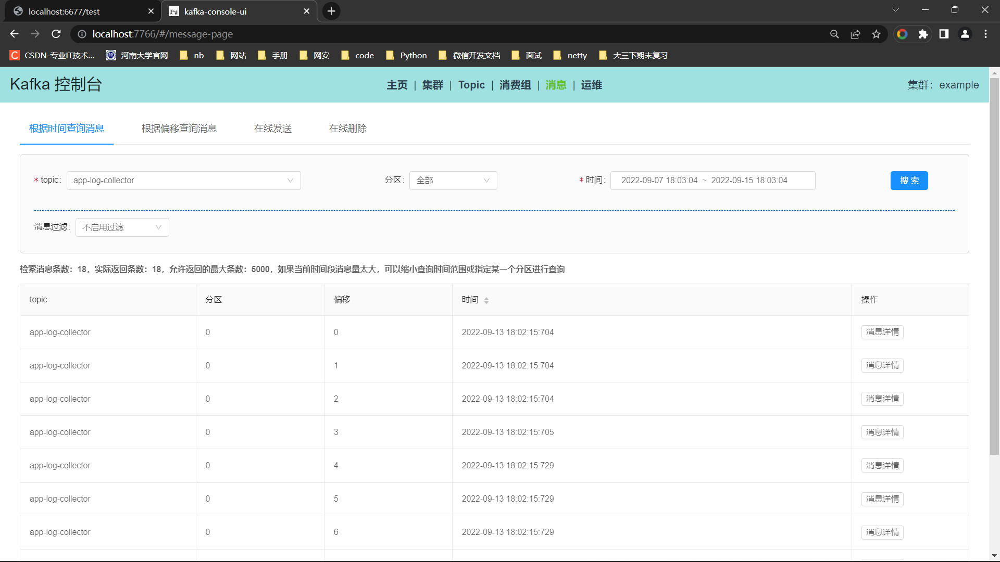

## 日志解决方案 simple-log-solution-scl

前言：

一个功能完善的日志系统是企业在日常产品、项目开发中是必须的，接触过bug fix的同学应该深有体会一份记录详细完善的日志能提升的小笼包，
之前参与项目架构技术会的时候，谈论到了日志技术的选型及实现，鉴于对该方面还不太熟悉，决定需要花时间学习实践一下，拿着常见成熟的轮子跑一跑...


日志一般分为：

- 系统日志：通俗理解就是涉及代码层面的日志如某个类、方法输出的信息，便于开发、测试等人员调试程序、排查问题
- 操作日志：系统中管理员、用户的某些操作如系统相关的分配账号权限，业务相关的如处理了订单，更新了库存等...，记录操作者的操作记录，便于后续分析存档

项目地址https://github.com/sichaolong/simple-log-solution-scl


项目结构：
```java
simple-log-solution-scl
    /-- canal：canal项目源码
    /-- simple-canal-example : 包含SimpleCanalClientExample客户端类测试canal
    /-- simple-canal-kafka-examle：canal整合kafka，springboot整合kafka消费数据
    /-- simple-logfile-example:原生方式log.info输出日志、保存日志到文件，美团开源仓库基于AOP利用注解实现日志输出
    /-- simple-logstash-elk-examle：入门级别轻量级的日志解决方案实践
    /-- simple-filebeat-elk-examle：引入filebeat、kafka之后海量数据级别的日志解决方案实现
    /-- README.md 
    /-- ...
```

参考：
- 美团技术团队：https://tech.meituan.com/2021/09/16/operational-logbook.html

### 常见的日志解决方案实践

#### 一、利用中间件Canal来记录操作日志

Canal 是一款基于 MySQL 数据库增量日志解析，提供增量数据订阅和消费的开源组件，通过采用监听数据库 Binlog 的方式，这样可以从底层知道是哪些数据做了修改，然后根据更改的数据记录操作日志。

这种方式的优点是和业务逻辑完全分离。缺点也很明显，局限性太高，只能针对数据库的更改做操作日志记录，如果修改涉及到其他团队的 RPC 的调用，就没办法监听数据库了，举个例子：给用户发送通知，通知服务一般都是公司内部的公共组件，这时候只能在调用 RPC 的时候手工记录发送通知的操作日志了。

参考阿里巴巴开源的cannel组件https://github.com/alibaba/canal，cannel订阅binlog日志，其他监听者消费cannel即可，具体可以实现以下功能：

- 数据库镜像
- 数据库实时备份
- 索引构建和实时维护(拆分异构索引、倒排索引等)
- 业务 cache 刷新
- 带业务逻辑的增量数据处理

##### 1、原理分析

其中cannel的工作原理就是基于MySQL的主从复制原理，其中MySQL主从复制大的原理大概如下

- MySQL master 将数据变更写入二进制日志( binary log, 其中记录叫做二进制日志事件binary log events，可以通过 show binlog events 进行查看)
- MySQL slave 将 master 的 binary log events 拷贝到它的中继日志(relay log)
- MySQL slave 重放 relay log 中事件，将数据变更反映它自己的数据

canal 工作原理是通过master、slave之间的通信协议将自己伪装成一个从数据库，然后订阅master的binlog日志

- canal 模拟 MySQL slave 的交互协议，伪装自己为 MySQL slave ，向 MySQL master 发送dump 协议
- MySQL master 收到 dump 请求，开始推送 binary log 给 slave (即 canal )
- canal 解析 binary log 对象(原始为 byte 流)


##### 2、canal实践


###### 2.1、开启MySQL主从、配置canal

参考quickstart文档：https://github.com/alibaba/canal/wiki/QuickStart，首先是配置my.cnf / my.ini 开启binlog功能，因为我直接在windows下进行实践

```mysql
# 不要修改windows下的my-default.ini文件 不是 ！！！位置：C:\Program Files\MySQL\MySQL Server 5.7）
# 需要注意的是图中的my.ini位于：C:\ProgramData\MySQL\MySQL Server 5.7，而不是位于：C:\Program Files\MySQL\MySQL Server 5.7 ！！！
# 开启MySQL的binlog功能
[mysqld]
log-bin=mysql-bin # 开启 binlog
binlog-format=ROW # 选择 ROW 模式
server_id=1 # 配置 MySQL replaction 需要定义，不要和 canal 的 slaveId 重复

# 之后别忘了重启！！！，然后可以root登录mysql,使用show master status 查看是否成功开启主从模式

```

然后就是允许cannel作为slave订阅binlog日志

```sql
CREATE USER canal IDENTIFIED BY 'canal';  
GRANT SELECT, REPLICATION SLAVE, REPLICATION CLIENT ON *.* TO 'canal'@'%';
-- GRANT ALL PRIVILEGES ON *.* TO 'canal'@'%' ;
FLUSH PRIVILEGES;
```

```sql
# windows下win + r 输入下列命令重启MySQL
net start mysql57
net start mysql57
```

下载deployer版本https://github.com/alibaba/canal/releases/tag/canal-1.1.5，接下来配置参考文档配置启动canal即可server日志位置logs/canal/canal.log。instance日志位置logs/example/example.log


注意：放置目录不要有中文！！！！


###### 2.2、测试使用客户端canal

参考文档https://github.com/alibaba/canal/wiki/ClientExample

启动canal-server、启动测试类SimpleCanalClientExample，修改数据库表数据，观察控制台

```
...
empty count : 36
empty count : 37
empty count : 38
empty count : 39
empty count : 40
empty count : 41
================&gt; binlog[mysql-bin.000001:345] , name[mpj,product] , eventType : UPDATE
-------&gt; before
id : 1    update=false
product_name : iPhone 13    update=false
unti_price : 4869    update=false
-------&gt; after
id : 1    update=false
product_name : iPhone 13    update=false
unti_price : 48690    update=true
empty count : 1
empty count : 2
empty count : 3
empty count : 4
empty count : 5
empty count : 6
empty count : 7
empty count : 8
empty count : 9
...
```


###### 2.3、测试部署canal-admin、canal-admin-ui

canal-admin设计上是为canal提供整体配置管理、节点运维等面向运维的功能，提供相对友好的WebUI操作界面，方便更多用户快速和安全的操作，**简单理解就是可以借助admin-ui的web页面远程运维canal-server服务。**

canal-admin的核心模型主要有：

1. instance，对应canal-server里的instance，一个最小的订阅mysql的队列
2. server，对应canal-server，一个server里可以包含多个instance
3. 集群，对应一组canal-server，组合在一起面向高可用HA的运维

简单解释

1. instance因为是最原始的业务订阅诉求，它会和 server/集群 这两个面向资源服务属性的进行关联，比如instance A绑定到server A上或者集群 A上，
2. 有了任务和资源的绑定关系后，对应的资源服务就会接收到这个任务配置，在对应的资源上动态加载instance，并提供服务
   - 动态加载的过程，有点类似于之前的autoScan机制，只不过基于canal-admin之后可就以变为远程的web操作，而不需要在机器上运维配置文件
3. 将server抽象成资源之后，原本canal-server运行所需要的canal.properties/instance.properties配置文件就需要在web ui上进行统一运维，每个server只需要以最基本的启动配置 (比如知道一下canal-admin的manager地址，以及访问配置的账号、密码即可)

需要配置下canal-server整合canal-admin，修改canal.properties文件部分内容如下

```
# register ip
canal.register.ip =

# canal admin config
canal.admin.manager = 127.0.0.1:8089
canal.admin.port = 11110
canal.admin.user = admin
canal.admin.passwd = 4ACFE3202A5FF5CF467898FC58AAB1D615029441
# admin auto register
canal.admin.register.auto = true
canal.admin.register.cluster =
```

参考文档https://github.com/alibaba/canal/wiki/Canal-Admin-QuickStart，最后执行startup.bat启动即可。可以通过 http://127.0.0.1:8089/ 访问，默认密码：admin/123456测试


可以在线更改canal-server的canal.properties配置


更多配置参考文档https://github.com/alibaba/canal/wiki/AdminGuide


###### 2.4、测试整合canal和MQ


canal 1.1.1版本之后, 默认支持将canal server接收到的binlog数据直接投递到MQ, 目前默认支持的MQ系统有:

- Kafka安装参考：[Kafka QuickStart](https://github.com/alibaba/canal/wiki/Kafka-QuickStart)
- RocketMQ安装参考：[RocketMQ QuickStart](https://rocketmq.apache.org/docs/quick-start)
- RabbitMQ安装参考：[RabbitMQ QuickStart](https://www.rabbitmq.com/download.html)
- PulsarMQ安装参考：[PulsarMQ QuickStart](https://pulsar.apache.org/docs/2.2.1/getting-started-docker/)

（1）安装Zookeeper

参考：https://github.com/alibaba/canal/wiki/Zookeeper-QuickStart。按照文档配置启动，打开命令行输入 `telnet 127.0.0.1 2181`测试kafka服务。

然后可以安装zk ui 可视化界面

```bash
# 1、拉取代码：
git clone https://github.com/DeemOpen/zkui.git

# 2、源码编译需要安装 maven
 wget http://repos.fedorapeople.org/repos/dchen/apache-maven/epel-apache-maven.repo -O /etc/yum.repos.d/epel-apache-maven.repo

cd zkui/

yum install -y maven

mvn clean install
# 3、修改配置文件默认值
 vim config.cfg
    serverPort=9090     #指定端口
    zkServer=xxx:2181
    sessionTimeout=300000
    
# 4、启动程序至后台 2.0-SNAPSHOT 会随软件的更新版本不同而不同，执行时请查看target 目录中真正生成的版本

 nohup java -jar target/zkui-2.0-SNAPSHOT-jar-with-dependencies.jar & 

# 5、用浏览器访问：
http://xxx:9090/
```


（2）安装Kafka

参考https://kafka.apache.org/downloads，https://github.com/alibaba/canal/wiki/Kafka-QuickStart

```bash

# 下载的kafka包里面包含了zookeeper，可以选用上一步安装的独立的zookeeper，也可以采用包含的，启动包含的zookeeper命令
.\bin\windows\zookeeper-server-start.bat .\config\zookeeper.properties

# 然后启动kafka命令
.\bin\windows\kafka-server-start.bat .\config\server.properties
# 测试是否启动成功

# 创建一个主题
.\bin\windows\kafka-topics.bat --create --bootstrap-server localhost:9092 --replication-factor 1 --partitions 1 --topic test         

# 查看主题
.\bin\windows\kafka-topics.bat --list --bootstrap-server localhost:9092
```

安装kafka可视化界面https://github.com/xxd763795151/kafka-console-ui


修改canal-server的配置文件，配置canal向MQ发送的topic

```bash


1.指明canal投到哪一个topic主题 进入 XXX\canal-service\conf\example 目录，修改 instance.properties
canal.mq.topic=example 修改为 canal.mq.topic=tst-topic（投到哪个MQ里面）

2.指明canal是kafka模式

进入 XXX\canal-service\conf
修改 canal.properties
将 canal.serverMode = tcp 修改为 canal.serverMode = kafka
支持模式 tcp, kafka, RocketMQ

3.指明canal投递到那个MQ地址

进入 XXX\canal-service\conf
修改 canal.properties

kafka.bootstrap.servers = 127.0.0.1:9092
kafka.acks = all
kafka.compression.type = none
kafka.batch.size = 16384
kafka.linger.ms = 1
kafka.max.request.size = 1048576
kafka.buffer.memory = 33554432
kafka.max.in.flight.requests.per.connection = 1
kafka.retries = 0

kafka.kerberos.enable = false
kafka.kerberos.krb5.file = "../conf/kerberos/krb5.conf"
kafka.kerberos.jaas.file = "../conf/kerberos/jaas.conf"

4.重启 启动

进入 XXX\canal-service\bin 目录下
运行 startup.bat

```


测试修改数据库表数据，canal能否将修改的日志发给MQ的example，经过测试kafka已经能收到消息


测试kafka消费example的消息，使用springboot整合kafka代码在simple-canal-kafka-example模块

需要注意的是配置kafka的配置consumer.properties文件，保证groupId和测试类中设置的一致，否则无法正确消费消息。


####  二、通过文件形式记录日志

这种方式的操作记录需要解决三个问题。

##### 1、操作人如何记录

借助 SLF4J 中的 MDC 工具类，把操作人放在日志中，然后在日志中统一打印出来。首先在用户的拦截器中把用户的标识 Put 到 MDC 中。什么是MDC参考https://blog.csdn.net/taiyangdao/article/details/82860105

```java
@Component
public class UserInterceptor extends HandlerInterceptorAdapter {
  @Override
  public boolean preHandle(HttpServletRequest request, HttpServletResponse response, Object handler) throws Exception {
    //获取到用户标识
    String userNo = getUserNo(request);
    //把用户 ID 放到 MDC 上下文中
    MDC.put("userId", userNo);
    return super.preHandle(request, response, handler);
  }

  private String getUserNo(HttpServletRequest request) {
    // 通过 SSO 或者Cookie 或者 Auth信息获取到 当前登陆的用户信息
    return null;
  }
}

// 其次，把 userId 格式化到日志中，使用 %X{userId} 可以取到 MDC 中用户标识。

<pattern>"%d{yyyy-MM-dd HH:mm:ss.SSS} %t %-5level %X{userId} %logger{30}.%method:%L - %msg%n"</pattern>
```


##### 2、操作日志如何和系统日志区分开

通过配置 Log 的配置文件，把有关操作日志的 Log 单独放到一日志文件中。

```xml
//不同业务日志记录到不同的文件
<appender name="businessLogAppender" class="ch.qos.logback.core.rolling.RollingFileAppender">
    <File>logs/business.log</File>
    <append>true</append>
    <filter class="ch.qos.logback.classic.filter.LevelFilter">
        <level>INFO</level>
        <onMatch>ACCEPT</onMatch>
        <onMismatch>DENY</onMismatch>
    </filter>
    <rollingPolicy class="ch.qos.logback.core.rolling.TimeBasedRollingPolicy">
        <fileNamePattern>logs/业务A.%d.%i.log</fileNamePattern>
        <maxHistory>90</maxHistory>
        <timeBasedFileNamingAndTriggeringPolicy class="ch.qos.logback.core.rolling.SizeAndTimeBasedFNATP">
            <maxFileSize>10MB</maxFileSize>
        </timeBasedFileNamingAndTriggeringPolicy>
    </rollingPolicy>
    <encoder>
        <pattern>"%d{yyyy-MM-dd HH:mm:ss.SSS} %t %-5level %X{userId} %logger{30}.%method:%L - %msg%n"</pattern>
        <charset>UTF-8</charset>
    </encoder>
</appender>
        
<logger name="businessLog" additivity="false" level="INFO">
    <appender-ref ref="businessLogAppender"/>
</logger>
```

然后在 Java 代码中单独的记录业务日志。

```java
//记录特定日志的声明
private final Logger businessLog = LoggerFactory.getLogger("businessLog");
 
//日志存储
businessLog.info("修改了配送地址");
```

##### 3、基于注解如何生成可读懂的日志文案

可以采用 自己封装的LogUtil 的方式，也可以采用切面的方式生成日志模板，后续内容将会进行介绍。这样就可以把日志单独保存在一个文件中，然后通过日志收集可以把日志保存在 Elasticsearch 或者数据库中，接下来看下如何生成可读的操作日志。

```java
private OnesIssueDO updateAddress(updateDeliveryRequest request) {
    DeliveryOrder deliveryOrder = deliveryQueryService.queryOldAddress(request.getDeliveryOrderNo());
    // 更新派送信息，电话，收件人，地址
    doUpdate(request);
    String logContent = getLogContent(request, deliveryOrder);
    LogUtils.logRecord(request.getOrderNo(), logContent, request.getOperator);
    return onesIssueDO;
}

private String getLogContent(updateDeliveryRequest request, DeliveryOrder deliveryOrder) {
    String template = "用户%s修改了订单的配送地址：从“%s”修改到“%s”";
    return String.format(tempalte, request.getUserName(), deliveryOrder.getAddress(), request.getAddress);
}
```

可以看到上面的例子使用了两个方法代码，外加一个 getLogContent 的函数实现了操作日志的记录。当业务变得复杂后，记录操作日志放在业务代码中会导致业务的逻辑比较繁杂，最后导致 LogUtils.logRecord() 方法的调用存在于很多业务的代码中，而且类似 getLogContent() 这样的方法也散落在各个业务类中，对于代码的可读性和可维护性来说是一个灾难。下面介绍下如何避免这个灾难。

为了解决上面问题，一般采用 AOP 的方式记录日志，让操作日志和业务逻辑解耦，接下来看一个简单的 AOP 日志的例子。

```java
@LogRecord(content="修改了配送地址")
public void modifyAddress(updateDeliveryRequest request){
    // 更新派送信息 电话，收件人、地址
    doUpdate(request);
}
```

我们可以在注解的操作日志上记录固定文案，这样业务逻辑和业务代码可以做到解耦，让我们的业务代码变得纯净起来。可能有同学注意到，上面的方式虽然解耦了操作日志的代码，但是记录的文案并不符合我们的预期，文案是静态的，没有包含动态的文案，因为我们需要记录的操作日志是： 用户%s修改了订单的配送地址，从“%s”修改到“%s”。接下来，我们介绍一下如何优雅地使用 AOP 生成动态的操作日志。

美团开源仓库https://github.com/mouzt/mzt-biz-log/blob/master/doc/document-2.x.md，另外一个开源的仓库https://github.com/qqxx6661/logRecord，测试使用的代码在simple-logfile-example中


###### 基于AOP注解日志实现原理分析

starter源码在simple-logfile-example/other-annotation-logsoultion-source-code，以此进行源码分析



**首先回顾自动装配的原理**

SpringBoot 定义了一套接口规范，这套规范规定：SpringBoot 在启动时会扫描外部引用 jar 包中的`META-INF/spring.factories`文件，将文件中配置的类型信息加载到 Spring 容器（此处涉及到 JVM 类加载机制与 Spring 的容器知识），并执行类中定义的各种操作。对于外部 jar 来说，只需要按照 SpringBoot 定义的标准，就能将自己的功能装置进 SpringBoot。想要使用某功能，只需要引入starter即可

大概可以把 `@SpringBootApplication`看作是 `@Configuration`、`@EnableAutoConfiguration`、`@ComponentScan` 注解的集合。根据 SpringBoot 官网，这三个注解的作用分别是：

- `@EnableAutoConfiguration`：启用 SpringBoot 的自动配置机制
- `@Configuration`：允许在上下文中注册额外的 bean 或导入其他配置类
- `@ComponentScan`： 扫描被`@Component` (`@Service`,`@Controller`)注解的 bean，注解默认会扫描启动类所在的包下所有的类 ，可以自定义不扫描某些 bean。

`EnableAutoConfiguration` 只是一个简单地注解，自动装配核心功能的实现实际是通过 `AutoConfigurationImportSelector`类。可以看出，`AutoConfigurationImportSelector` 类实现了 `ImportSelector`接口，也就实现了这个接口中的 `selectImports`方法，该方法主要用于**获取所有符合条件的类的全限定类名，这些类需要被加载到 IoC 容器中**。

不光是这个依赖下的`META-INF/spring.factories`被读取到，所有 Spring Boot Starter 下的`META-INF/spring.factories`中声明的自动配置类，都会被读取到。当然全部导入也不现实，因此又经历了一遍筛选，`@ConditionalOnXXX` 中的所有条件都满足，该类才会生效。

```java
@Configuration
// 检查相关的类：RabbitTemplate 和 Channel是否存在
// 存在才会加载
@ConditionalOnClass({ RabbitTemplate.class, Channel.class })
@EnableConfigurationProperties(RabbitProperties.class)
@Import(RabbitAnnotationDrivenConfiguration.class)
public class RabbitAutoConfiguration {
}

```

自己写一个简单的starter栗子，基本步骤

1. 新建Maven工程，在pom文件定义相关信息，如需要用到Spring则引入`spring-boot-dependencies`进而引入`spring-boot-autoconfigure`
2. 定义一个接口如XxxService，对外暴露可以直接调用。定义一个实现类XxxServiceImpl实现接口，加上@Component注解放置Spring容器
3. 编写XxxAutoConfiguration 自动配置类，类上标注@Configuration注解标识是一个类似xml的配置类，然后配置@ComponentScan扫描需要暴露的XxxServiceImpl所在的包。(将扫包的义务交给Starter自己，如果都需要主模块main函数去扫包，则后续不易维护，在SpringBoot之前，需要将扫包配置到xml文件中，交给主模块完成，耦合度较高)
4. 最后在Spring的根路径下，即resources文件夹下创建META-INF/spring.factories文件，用于指定当前Starter的XxxAutoConfiguration自动配置类的路径


###### 1、配置读取与自动配置

（1）来到logRecord，它是是一个SpringBoot工程，作为一个starter是完全没问题的，定义了

```properties
# spring.factories文件
org.springframework.boot.autoconfigure.EnableAutoConfiguration=\
  cn.monitor4all.logRecord.configuration.LogRecordAutoConfiguration
  
```

（2）来到该starter的自动配置类

```java
// 1、LogRecordAutoConfiguration类

package cn.monitor4all.logRecord.configuration;

import org.springframework.context.annotation.ComponentScan;
import org.springframework.context.annotation.Import;

@ComponentScan("cn.monitor4all.logRecord") // 扫包
@Import({RabbitMqSenderConfiguration.class,
         RocketMqSenderConfiguration.class}) // 导入其他功能必要配置类，这两个类内部需要用到@ConditionOnXxx注解
public class LogRecordAutoConfiguration {

}

// 2、RabbitMqSenderConfiguration类为例

@Slf4j
@Configuration
@ConditionalOnProperty(name = "log-record.data-pipeline", havingValue = LogConstants.DataPipeline.RABBIT_MQ)
@EnableConfigurationProperties({LogRecordProperties.class})
public class RabbitMqSenderConfiguration {

    private String rabbitHost;
    private int rabbitPort;
    private String exchange;
    private String queue;
    private String routingKey;
    private String username;
    private String password;

    @Autowired
    private LogRecordProperties properties;

    @PostConstruct // 这个注解会在bean执行完构造参数之后，实例化之后，初始化之前完成读取properties文件读取,然后从LogRecordProperties实例拿到配置
    public void rabbitMqConfig() {
        this.rabbitHost = properties.getRabbitMqProperties().getHost();
        this.rabbitPort = properties.getRabbitMqProperties().getPort();
        this.queue = properties.getRabbitMqProperties().getQueueName();
        this.routingKey = properties.getRabbitMqProperties().getRoutingKey();
        this.exchange= properties.getRabbitMqProperties().getExchangeName();
        this.username= properties.getRabbitMqProperties().getUsername();
        this.password= properties.getRabbitMqProperties().getPassword();
        log.info("LogRecord RabbitMqSenderConfiguration host [{}] port [{}] exchange [{}] queue [{}] routingKey [{}]",
                rabbitHost, rabbitPort, exchange, queue, routingKey);
    }
    // ... 省了MQ需要的一些@Bean的组件 ...
}


// 3、LogRecordProperties 类

@Data
@ConfigurationProperties(prefix = "log-record")
public class LogRecordProperties {
    // ... 省略pojo类型的成员变量 ...对应着properties文件配置的值
}


```


###### 2、自定义注解

自定义了四个注解

```
@OperationLog：核心功能体现，将注解标注指定方法上面，然后指定一些模板，以及SpringEL从上下文、方法参数 等取值。 如 "xxx 干了 xxx"，然后Spring会在方法执行的时候AOP拦截制定方法，然后输出日志到控制台、文件、MQ等

@LogRecordFunc：日志功能拓展，使用该注解可以自定义方法，@OperationLog可以从自定义的方法获取指定返回值，如每条记录需要一个业务bizId，可以自定义方法返回，然后使用SpringEL表达式取出来

@LogRecordDiff：日志共嫩拓展，字段别名相关

@OperationLogs：日志功能拓展，重复注解相关

```


###### 3、AOP方法环绕增强

声明切面，拦截标注@OperationLog的方法，前置先解析一次方法，将重复的@OperationLog放到一个Map，然后方法执行，后置增强在LogRecordContext上下文中写入执行后信息，可以理解为kv形式的键值对，然后提交给线程池进行日志处理（控制台输出，发送到MQ）



```java

@Aspect
@Component
@Slf4j
public class SystemLogAspect {

    @Autowired(required = false)
    private LogRecordThreadPool logRecordThreadPool;

    @Autowired(required = false)
    private LogService logService;

    @Autowired(required = false)
    private IOperationLogGetService iOperationLogGetService;

    @Autowired(required = false)
    private IOperatorIdGetService iOperatorIdGetService;

    private final SpelExpressionParser parser = new SpelExpressionParser();

    private final DefaultParameterNameDiscoverer discoverer = new DefaultParameterNameDiscoverer();

    @Around("@annotation(cn.monitor4all.logRecord.annotation.OperationLog) " +
            "|| @annotation(cn.monitor4all.logRecord.annotation.OperationLogs)")
    public Object doAround(ProceedingJoinPoint pjp) throws Throwable {
        Object result;
        OperationLog[] annotations;
        List<LogDTO> logDTOList = new ArrayList<>();
        Map<OperationLog, LogDTO> logDtoMap = new LinkedHashMap<>();
        StopWatch stopWatch = null;
        Long executionTime = null;

        // 注解解析：若解析失败直接不执行日志切面逻辑
        try {
            Method method = getMethod(pjp);
            annotations = method.getAnnotationsByType(OperationLog.class);
        } catch (Throwable throwable) {
            return pjp.proceed();
        }

        // 日志切面逻辑
        try {
            // 方法执行前日志切面
            try {
                // 将前置和后置执行的注解分开处理并保证最终写入顺序
                for (OperationLog annotation : annotations) {
                    if (annotation.executeBeforeFunc()) {
                        LogDTO logDTO = resolveExpress(annotation, pjp);
                        if (logDTO != null) {
                            logDtoMap.put(annotation, logDTO);
                        }
                    }
                }
                stopWatch = new StopWatch();
                stopWatch.start();
            } catch (Throwable throwableBeforeFunc) {
                log.error("OperationLogAspect doAround before function, error:", throwableBeforeFunc);
            }
            // 原方法执行
            result = pjp.proceed();
            // 方法成功执行后日志切面
            try {
                if (stopWatch != null) {
                    stopWatch.stop();
                    executionTime = stopWatch.getTotalTimeMillis();
                }
                // 在LogRecordContext中写入执行后信息
                LogRecordContext.putVariable(LogRecordContext.CONTEXT_KEY_NAME_RETURN, result);
                for (OperationLog annotation : annotations) {
                    if (!annotation.executeBeforeFunc()) {
                        LogDTO logDTO = resolveExpress(annotation, pjp);
                        if (logDTO != null) {
                            logDtoMap.put(annotation, logDTO);
                        }
                    }
                }
                // 写入成功执行后日志
                logDTOList = new ArrayList<>(logDtoMap.values());
                logDtoMap.forEach((annotation, logDTO) -> {
                    // 若自定义成功失败，则logDTO.getSuccess非null
                    if (logDTO.getSuccess() == null) {
                        logDTO.setSuccess(true);
                    }
                    if (annotation.recordReturnValue()) {
                        logDTO.setReturnStr(JSON.toJSONString(result));
                    }
                });
            } catch (Throwable throwableAfterFuncSuccess) {
                log.error("OperationLogAspect doAround after function success, error:", throwableAfterFuncSuccess);
            }

        }
        // 原方法执行异常
        catch (Throwable throwable) {
            // 方法异常执行后日志切面
            try {
                if (stopWatch != null) {
                    stopWatch.stop();
                    executionTime = stopWatch.getTotalTimeMillis();
                }
                // 在LogRecordContext中写入执行后信息
                LogRecordContext.putVariable(LogRecordContext.CONTEXT_KEY_NAME_ERROR_MSG, throwable.getMessage());
                for (OperationLog annotation : annotations) {
                    if (!annotation.executeBeforeFunc()) {
                        logDtoMap.put(annotation, resolveExpress(annotation, pjp));
                    }
                }
                // 写入异常执行后日志
                logDTOList = new ArrayList<>(logDtoMap.values());
                logDTOList.forEach(logDTO -> {
                    logDTO.setSuccess(false);
                    logDTO.setException(throwable.getMessage());
                });
            } catch (Throwable throwableAfterFuncFailure) {
                log.error("OperationLogAspect doAround after function failure, error:", throwableAfterFuncFailure);
            }
            // 抛出原方法异常
            throw throwable;
        } finally {
            try {
                // 提交日志至主线程或线程池
                Long finalExecutionTime = executionTime;
                Consumer<LogDTO> createLogFunction = logDTO -> {
                    try {
                        // 记录执行时间
                        logDTO.setExecutionTime(finalExecutionTime);
                        // 发送日志本地监听
                        if (iOperationLogGetService != null) {
                            iOperationLogGetService.createLog(logDTO);
                        }
                        // 发送消息管道
                        if (logService != null) {
                            logService.createLog(logDTO);
                        }
                    } catch (Throwable throwable) {
                        log.error("OperationLogAspect send logDTO error", throwable);
                    }
                };
                if (logRecordThreadPool != null) {
                    logDTOList.forEach(logDTO -> logRecordThreadPool.getLogRecordPoolExecutor().submit(() -> createLogFunction.accept(logDTO)));
                } else {
                    logDTOList.forEach(createLogFunction);
                }
                // 清除Context：每次方法执行一次
                LogRecordContext.clearContext();
            } catch (Throwable throwableFinal) {
                log.error("OperationLogAspect doAround final error", throwableFinal);
            }
        }
        return result;
    }

    private LogDTO resolveExpress(OperationLog annotation, JoinPoint joinPoint) {
        LogDTO logDTO = null;
        String bizIdSpel = annotation.bizId();
        String bizTypeSpel = annotation.bizType();
        String tagSpel = annotation.tag();
        String msgSpel = annotation.msg();
        String extraSpel = annotation.extra();
        String operatorIdSpel = annotation.operatorId();
        String conditionSpel = annotation.condition();
        String successSpel = annotation.success();
        String bizId = bizIdSpel;
        String bizType = bizTypeSpel;
        String tag = tagSpel;
        String msg = msgSpel;
        String extra = extraSpel;
        String operatorId = operatorIdSpel;
        Boolean functionExecuteSuccess = null;
        try {
            Object[] arguments = joinPoint.getArgs();
            Method method = getMethod(joinPoint);
            String[] params = discoverer.getParameterNames(method);
            StandardEvaluationContext context = LogRecordContext.getContext();
            CustomFunctionRegistrar.register(context);
            if (params != null) {
                for (int len = 0; len < params.length; len++) {
                    context.setVariable(params[len], arguments[len]);
                }
            }

            // condition 处理：SpEL解析 必须符合表达式
            if (StringUtils.isNotBlank(conditionSpel)) {
                Expression conditionExpression = parser.parseExpression(conditionSpel);
                boolean passed = Boolean.TRUE.equals(conditionExpression.getValue(context, Boolean.class));
                if (!passed) {
                    return null;
                }
            }

            // success 处理：SpEL解析 必须符合表达式
            if (StringUtils.isNotBlank(successSpel)) {
                Expression successExpression = parser.parseExpression(successSpel);
                functionExecuteSuccess = Boolean.TRUE.equals(successExpression.getValue(context, Boolean.class));
            }

            // bizId 处理：SpEL解析 必须符合表达式
            if (StringUtils.isNotBlank(bizIdSpel)) {
                Expression bizIdExpression = parser.parseExpression(bizIdSpel);
                bizId = bizIdExpression.getValue(context, String.class);
            }

            // bizType 处理：SpEL解析 必须符合表达式
            if (StringUtils.isNotBlank(bizTypeSpel)) {
                Expression bizTypeExpression = parser.parseExpression(bizTypeSpel);
                bizType = bizTypeExpression.getValue(context, String.class);
            }

            // tag 处理：SpEL解析 必须符合表达式
            if (StringUtils.isNotBlank(tagSpel)) {
                Expression tagExpression = parser.parseExpression(tagSpel);
                tag = tagExpression.getValue(context, String.class);
            }

            // msg 处理：SpEL解析 必须符合表达式 若为实体则JSON序列化实体
            if (StringUtils.isNotBlank(msgSpel)) {
                Expression msgExpression = parser.parseExpression(msgSpel);
                Object msgObj = msgExpression.getValue(context, Object.class);
                msg = msgObj instanceof String ? (String) msgObj : JSON.toJSONString(msgObj, SerializerFeature.WriteMapNullValue);
            }

            // extra 处理：SpEL解析 必须符合表达式 若为实体则JSON序列化实体
            if (StringUtils.isNotBlank(extraSpel)) {
                Expression extraExpression = parser.parseExpression(extraSpel);
                Object extraObj = extraExpression.getValue(context, Object.class);
                extra = extraObj instanceof String ? (String) extraObj : JSON.toJSONString(extraObj, SerializerFeature.WriteMapNullValue);
            }

            // operatorId 处理：优先级 注解传入 > 自定义接口实现
            // 必须符合表达式
            if (iOperatorIdGetService != null) {
                operatorId = iOperatorIdGetService.getOperatorId();
            }
            if (StringUtils.isNotBlank(operatorIdSpel)) {
                Expression operatorIdExpression = parser.parseExpression(operatorIdSpel);
                operatorId = operatorIdExpression.getValue(context, String.class);
            }

            logDTO = new LogDTO();
            logDTO.setLogId(UUID.randomUUID().toString());
            logDTO.setBizId(bizId);
            logDTO.setBizType(bizType);
            logDTO.setTag(tag);
            logDTO.setOperateDate(new Date());
            logDTO.setMsg(msg);
            logDTO.setExtra(extra);
            logDTO.setOperatorId(operatorId);
            logDTO.setSuccess(functionExecuteSuccess);
            logDTO.setDiffDTOList(LogRecordContext.getDiffDTOList());
        } catch (Exception e) {
            log.error("OperationLogAspect resolveExpress error", e);
        } finally {
            // 清除Diff实体列表：每次注解执行一次
            LogRecordContext.clearDiffDTOList();
        }
        return logDTO;
    }

    private Method getMethod(JoinPoint joinPoint) {
        Method method = null;
        try {
            Signature signature = joinPoint.getSignature();
            MethodSignature ms = (MethodSignature) signature;
            Object target = joinPoint.getTarget();
            method = target.getClass().getMethod(ms.getName(), ms.getParameterTypes());
        } catch (NoSuchMethodException e) {
            log.error("OperationLogAspect getMethod error", e);
        }
        return method;
    }
}

```


#### 三、ELK日志解决方案实践

ELK架构演进参考https://www.cnblogs.com/tanwentao/p/15749435.html

目前大多数项目都是采用微服务架构，在项目的初期，为了按计划上线就没有搭建日志收集分析平台，日志都是保存在服务器本地，看日志时一个个的找。随着项目的服务越来越多，各个服务都是集群部署，服务器数量也快速增长，此时就暴露了很多的问题：

- 问题排查困难，查询一个服务的日志，需要登录多台服务器；
- 日志串接困难，一个流程有多个节点，要把整个流程的日志串接起来工作量大；
- 运维管理困难，不是每个同事都有登录服务器查看日志的权限，但又需要根据日志排查问题，就需要有权限的同事下载日志后给到相应负责的同事。
- 系统预警困难，无法实现服务出现异常后，及时通知到相应的负责人


正常情况下需要在linux服务器上安装服务或者使用docker拉去es、kibana、logstash镜像安装服务，这里我在windows上直接实践。


##### 1、环境安装

参考https://blog.csdn.net/weixin_45728976/article/details/106129058，尽量保证三个版本一致，我之前安装的es是7.13.3，下面两个保持一致

- es官网：https://www.elastic.co/cn/downloads/elasticsearch

- logstash官网：https://www.elastic.co/cn/downloads/logstash
- kibana国内镜像：https://mirrors.huaweicloud.com/kibana/7.13.3/

如果官网下载太慢直接从https://elasticsearch.cn/download/下载，启动es访问localhost:5600测试，启动kinaba访问localhost5601访问测试。

对于logstash启动需要指定配置文件启动命令 `logstash -f ../config/logstash.conf`，logstash.conf内容，注意如果es配置了x-pack登录认证，这里的配置文件一定要配置账号密码，否则报错，见后面的报错...

```conf
input {
  tcp {
    mode => "server"
    host => "0.0.0.0"
    port => 4560
    codec => json_lines
  }
}
output {
  elasticsearch {
    hosts => "localhost:9200"
    // es索引存储名称
    index => "springboot-%{+YYYY.MM.dd}"
    user => "elastic"
    password => "jKr3gNyLcDnvv1ostjP0"
  }
}
```


然后安装一下插件`logstash-plugin install logstash-codec-json_lines`


###### 报错解决

报错：Elasticsearch built-in security features are not enabled. Without authentication, your cluster could be accessible to anyone. See https://www.elastic.co/guide/en/elasticsearch/reference/7.13/security-minimal-setup.html to enable security.意思就是本地的kibana不能直接操作es了，需要在es设置一个账户密码，在kibana配置文件中配置验证，然后才能连接执行命令。

解决：按照官网的提示设置elasticsearch.yml文件启动es安全功能，参考：https://www.elastic.co/guide/en/elasticsearch/reference/7.13/security-minimal-setup.html


```java
// 执行 elasticsearch-setup-passwords auto 随机生成密码
Changed password for user apm_system
PASSWORD apm_system = xjs3ShoWt64oI6aXH31J

Changed password for user kibana_system
PASSWORD kibana_system = jRpUJIrydkAKVQeqyicg

Changed password for user kibana
PASSWORD kibana = jRpUJIrydkAKVQeqyicg

Changed password for user logstash_system
PASSWORD logstash_system = iIttpbbbgQPtbyyVVh9J

Changed password for user beats_system
PASSWORD beats_system = EXCCkvKRu3qACJ92flvf

Changed password for user remote_monitoring_user
PASSWORD remote_monitoring_user = FCoK0QL2cG5Z7DqjuHaB

Changed password for user elastic
PASSWORD elastic = jKr3gNyLcDnvv1ostjP0
```

保证三者都能启动成功。


##### 2、SpringBoot整合入门级的ELK


1、首先新建sprinboot工程，导入依赖

```xml
<!--集成logstash-->
<dependency>
    <groupId>net.logstash.logback</groupId>
    <artifactId>logstash-logback-encoder</artifactId>
    <version>5.3</version>
</dependency>

```


2、添加配置文件logback-spring.xml让logback的日志输出到logstash

```xml
<?xml version="1.0" encoding="UTF-8"?>
<!-- 日志级别从低到高分为TRACE < DEBUG < INFO < WARN < ERROR < FATAL，如果设置为WARN，则低于WARN的信息都不会输出 -->

<!-- scan:当此属性设置为true时，配置文档如果发生改变，将会被重新加载，默认值为true -->

<!-- scanPeriod:设置监测配置文档是否有修改的时间间隔，如果没有给出时间单位，默认单位是毫秒。
             当scan为true时，此属性生效。默认的时间间隔为1分钟。 -->
<!-- debug:当此属性设置为true时，将打印出logback内部日志信息，实时查看logback运行状态。默认值为false。 -->


<configuration  scan="true" scanPeriod="10 seconds" >
    <contextName>logback-spring</contextName>

    <!-- name的值是变量的名称，value的值时变量定义的值。通过定义的值会被插入到logger上下文中。定义后，可以使“${}”来使用变量。 -->
    <!--    <property name="logging.path" value="./logs/" />-->


    <!--0. 日志格式和颜色渲染 -->

    <!-- 0.1彩色日志依赖的渲染类 -->
    <conversionRule conversionWord="clr" converterClass="org.springframework.boot.logging.logback.ColorConverter" />
    <conversionRule conversionWord="wex" converterClass="org.springframework.boot.logging.logback.WhitespaceThrowableProxyConverter" />
    <conversionRule conversionWord="wEx" converterClass="org.springframework.boot.logging.logback.ExtendedWhitespaceThrowableProxyConverter" />

    <!-- 0.2彩色日志格式 -->
    <property name="CONSOLE_LOG_PATTERN" value="${CONSOLE_LOG_PATTERN:-%clr(%d{yyyy-MM-dd HH:mm:ss.SSS}){faint} %clr(${LOG_LEVEL_PATTERN:-%5p}) %clr(${PID:- }){magenta} %clr(---){faint} %clr([%15.15t]){faint} %clr(%-40.40logger{39}){cyan} %clr(:){faint} %m%n${LOG_EXCEPTION_CONVERSION_WORD:-%wEx}}"/>

    <!--1. 输出到控制台-->
    <appender name="CONSOLE" class="ch.qos.logback.core.ConsoleAppender">
        <!--此日志appender是为开发使用，只配置最底级别，控制台输出的日志级别是大于或等于此级别的日志信息-->
        <filter class="ch.qos.logback.classic.filter.ThresholdFilter">
            <level>INFO</level>
        </filter>
        <encoder>
            <Pattern>${CONSOLE_LOG_PATTERN}</Pattern>
            <!-- 设置字符集 -->
            <charset>UTF-8</charset>
        </encoder>
    </appender>

    <!--2. 输出到文档-->
    <!-- 2.1 level为 DEBUG 日志，时间滚动输出  -->
    <appender name="DEBUG_FILE" class="ch.qos.logback.core.rolling.RollingFileAppender">
        <!-- 正在记录的日志文档的路径及文档名 -->
        <file>${logging.path}/web_debug.log</file>
        <!--日志文档输出格式-->
        <encoder>
            <pattern>%d{yyyy-MM-dd HH:mm:ss.SSS} [%thread] %-5level %logger{50} - %msg%n</pattern>
            <charset>UTF-8</charset> <!-- 设置字符集 -->
        </encoder>
        <!-- 日志记录器的滚动策略，按日期，按大小记录 -->
        <rollingPolicy class="ch.qos.logback.core.rolling.TimeBasedRollingPolicy">
            <!-- 日志归档 -->
            <fileNamePattern>${logging.path}/web-debug-%d{yyyy-MM-dd}.%i.log</fileNamePattern>
            <timeBasedFileNamingAndTriggeringPolicy class="ch.qos.logback.core.rolling.SizeAndTimeBasedFNATP">
                <maxFileSize>100MB</maxFileSize>
            </timeBasedFileNamingAndTriggeringPolicy>
            <!--日志文档保留天数-->
            <maxHistory>15</maxHistory>
        </rollingPolicy>
        <!-- 此日志文档只记录debug级别的 -->
        <filter class="ch.qos.logback.classic.filter.LevelFilter">
            <level>debug</level>
            <onMatch>ACCEPT</onMatch>
            <onMismatch>DENY</onMismatch>
        </filter>
    </appender>

    <!-- 2.2 level为 INFO 日志，时间滚动输出  -->
    <appender name="INFO_FILE" class="ch.qos.logback.core.rolling.RollingFileAppender">
        <!-- 正在记录的日志文档的路径及文档名 -->
        <file>${logging.path}/web_info.log</file>
        <!--日志文档输出格式-->
        <encoder>
            <pattern>"%d{yyyy-MM-dd HH:mm:ss.SSS} %t %-5level %X{name} %logger{30}.%method:%L - %msg%n"</pattern>

            <!--            <pattern>%d{yyyy-MM-dd HH:mm:ss.SSS} [%thread] %-5level %logger{50} - %msg%n</pattern>-->
            <charset>UTF-8</charset>
        </encoder>
        <!-- 日志记录器的滚动策略，按日期，按大小记录 -->
        <rollingPolicy class="ch.qos.logback.core.rolling.TimeBasedRollingPolicy">
            <!-- 每天日志归档路径以及格式 -->
            <fileNamePattern>${logging.path}/web-info-%d{yyyy-MM-dd}.%i.log</fileNamePattern>
            <timeBasedFileNamingAndTriggeringPolicy class="ch.qos.logback.core.rolling.SizeAndTimeBasedFNATP">
                <maxFileSize>100MB</maxFileSize>
            </timeBasedFileNamingAndTriggeringPolicy>
            <!--日志文档保留天数-->
            <maxHistory>15</maxHistory>
        </rollingPolicy>
        <!-- 此日志文档只记录info级别的 -->
        <filter class="ch.qos.logback.classic.filter.LevelFilter">
            <level>info</level>
            <onMatch>ACCEPT</onMatch>
            <onMismatch>DENY</onMismatch>
        </filter>
    </appender>

    <!-- 2.3 level为 WARN 日志，时间滚动输出  -->
    <appender name="WARN_FILE" class="ch.qos.logback.core.rolling.RollingFileAppender">
        <!-- 正在记录的日志文档的路径及文档名 -->
        <file>${logging.path}/web_warn.log</file>
        <!--日志文档输出格式-->
        <encoder>
            <pattern>%d{yyyy-MM-dd HH:mm:ss.SSS} [%thread] %-5level %logger{50} - %msg%n</pattern>
            <charset>UTF-8</charset> <!-- 此处设置字符集 -->
        </encoder>
        <!-- 日志记录器的滚动策略，按日期，按大小记录 -->
        <rollingPolicy class="ch.qos.logback.core.rolling.TimeBasedRollingPolicy">
            <fileNamePattern>${logging.path}/web-warn-%d{yyyy-MM-dd}.%i.log</fileNamePattern>
            <timeBasedFileNamingAndTriggeringPolicy class="ch.qos.logback.core.rolling.SizeAndTimeBasedFNATP">
                <maxFileSize>100MB</maxFileSize>
            </timeBasedFileNamingAndTriggeringPolicy>
            <!--日志文档保留天数-->
            <maxHistory>15</maxHistory>
        </rollingPolicy>
        <!-- 此日志文档只记录warn级别的 -->
        <filter class="ch.qos.logback.classic.filter.LevelFilter">
            <level>warn</level>
            <onMatch>ACCEPT</onMatch>
            <onMismatch>DENY</onMismatch>
        </filter>
    </appender>

    <!-- 2.4 level为 ERROR 日志，时间滚动输出  -->
    <appender name="ERROR_FILE" class="ch.qos.logback.core.rolling.RollingFileAppender">
        <!-- 正在记录的日志文档的路径及文档名 -->
        <file>${logging.path}/web_error.log</file>
        <!--日志文档输出格式-->
        <encoder>
            <pattern>%d{yyyy-MM-dd HH:mm:ss.SSS} [%thread] %-5level %logger{50} - %msg%n</pattern>
            <charset>UTF-8</charset> <!-- 此处设置字符集 -->
        </encoder>
        <!-- 日志记录器的滚动策略，按日期，按大小记录 -->
        <rollingPolicy class="ch.qos.logback.core.rolling.TimeBasedRollingPolicy">
            <fileNamePattern>${logging.path}/web-error-%d{yyyy-MM-dd}.%i.log</fileNamePattern>
            <timeBasedFileNamingAndTriggeringPolicy class="ch.qos.logback.core.rolling.SizeAndTimeBasedFNATP">
                <maxFileSize>100MB</maxFileSize>
            </timeBasedFileNamingAndTriggeringPolicy>
            <!--日志文档保留天数-->
            <maxHistory>15</maxHistory>
        </rollingPolicy>
        <!-- 此日志文档只记录ERROR级别的 -->
        <filter class="ch.qos.logback.classic.filter.LevelFilter">
            <level>ERROR</level>
            <onMatch>ACCEPT</onMatch>
            <onMismatch>DENY</onMismatch>
        </filter>
    </appender>


    <!--3. 输出到logstash的appender -->
    <appender name="LOGSTASH" class="net.logstash.logback.appender.LogstashTcpSocketAppender">
        <!--可以访问的logstash日志收集端口，在logstash.conf文件配置-->
        <destination>127.0.0.1:4560</destination>
        <encoder charset="UTF-8" class="net.logstash.logback.encoder.LogstashEncoder"/>
    </appender>

    <!--
        <logger>用来设置某一个包或者具体的某一个类的日志打印级别、
        以及指定<appender>。<logger>仅有一个name属性，
        一个可选的level和一个可选的addtivity属性。
        name:用来指定受此logger约束的某一个包或者具体的某一个类。
        level:用来设置打印级别，大小写无关：TRACE, DEBUG, INFO, WARN, ERROR, ALL 和 OFF，
              还有一个特俗值INHERITED或者同义词NULL，代表强制执行上级的级别。
              如果未设置此属性，那么当前logger将会继承上级的级别。
        addtivity:是否向上级logger传递打印信息。默认是true。
        <logger name="org.springframework.web" level="info"/>
        <logger name="org.springframework.scheduling.annotation.ScheduledAnnotationBeanPostProcessor" level="INFO"/>
    -->

    <!--
        使用mybatis的时候，sql语句是debug下才会打印，而这里我们只配置了info，所以想要查看sql语句的话，有以下两种操作：
        第一种把<root level="info">改成<root level="DEBUG">这样就会打印sql，不过这样日志那边会出现很多其他消息
        第二种就是单独给dao下目录配置debug模式，代码如下，这样配置sql语句会打印，其他还是正常info级别：
        【logging.level.org.mybatis=debug logging.level.dao=debug】
     -->

    <!--
        root节点是必选节点，用来指定最基础的日志输出级别，只有一个level属性
        level:用来设置打印级别，大小写无关：TRACE, DEBUG, INFO, WARN, ERROR, ALL 和 OFF，
        不能设置为INHERITED或者同义词NULL。默认是DEBUG
        可以包含零个或多个元素，标识这个appender将会添加到这个logger。
    -->

    <!-- 4. 最终的策略 -->
    <!-- 4.1 开发环境:打印控制台-->

    <!--    <springProfile name="dev">-->
        <!--    <logger name="com.yifan.im.sys" level="debug"/>&lt;!&ndash; 修改此处扫描包名 &ndash;&gt;-->
    <!--    </springProfile>-->

<!--    指定生效的级别-->
    <root level="INFO_FILE">
        <appender-ref ref="CONSOLE" />
        <appender-ref ref="DEBUG_FILE" />
        <appender-ref ref="INFO_FILE" />
        <appender-ref ref="WARN_FILE" />
        <appender-ref ref="ERROR_FILE" />
        <appender-ref ref="LOGSTASH" />
    </root>

    <!--     4.2 生产环境:输出到文档-->
    <springProfile name="pro">
        <root level="info">
            <appender-ref ref="CONSOLE" />
            <appender-ref ref="DEBUG_FILE" />
            <appender-ref ref="INFO_FILE" />
            <appender-ref ref="ERROR_FILE" />
            <appender-ref ref="WARN_FILE" />
            <appender-ref ref="LOGSTASH" />
        </root>
    </springProfile>
</configuration>

```


3、启动项目测试，查看kibana有无日志


kibana可视化查看es数据https://blog.csdn.net/liuming690452074/article/details/120106397


###### 报错解决

其中logstash报了一个错:`BadResponseCodeError, :message=>"Got response code '401' contacting Elasticsearch at URL 'http://localhost:9200/'"}`，因为配置了es的x-pack，因此需要在logstash.conf配置认证。解决方法https://elasticsearch.cn/question/2345


##### 3、引入kafka、filebeat升级版的ELK

上述基本ELK架构入门级版本的缺点主要是两个

- 在大并发情况下，日志传输峰值比较大。如果直接写入ES，ES的HTTP API处理能力有限，在日志写入频繁的情况下可能会超时、丢失，所以需要一个缓冲中间件。
- 注意了，Logstash将Log读出、过滤、输出都是在应用服务器上进行的，这势必会造成服务器上占用系统资源较高，性能不佳，需要进行拆分。

因此升级版的ELK架构引入kafka、filebeat，它是一个轻量级的日志收集处理工具(Agent)，Filebeat占用资源少，适合于在各个服务器上搜集日志后传输给Logstash，官方也推荐此工具。基本流程就是filebeat会读取app生成的xxx.log文件，Filebeat由两个主要组件组成：prospectors 和 harvesters。这两个组件协同工作将文件变动发送到指定的输出kafka中，然后logstash消费kafka即可。加入kafka的好处就是如果其他业务需要进行日志分析，可以直接消费kafka里面的日志，不同业务模块之间的耦合度较小。




整合参考：https://blog.51cto.com/zhongmayisheng/4292182

###### 1、使用log4j2代替默认的Logback


新建springboot工程，pom依赖如下

```xml
<dependencies>
        <dependency>
            <groupId>org.springframework.boot</groupId>
            <artifactId>spring-boot-starter-web</artifactId>
            <!--  排除spring-boot-starter-logging ，也就是排除默认的LogBack，使用log4j2依赖。-->
            <exclusions>
                <exclusion>
                    <groupId>org.springframework.boot</groupId>
                    <artifactId>spring-boot-starter-logging</artifactId>
                </exclusion>
            </exclusions>
        </dependency>
        <!-- log4j2 -->
        <dependency>
            <groupId>org.springframework.boot</groupId>
            <artifactId>spring-boot-starter-log4j2</artifactId>
        </dependency>
        <!-- 异步日志-->
        <dependency>
            <groupId>com.lmax</groupId>
            <artifactId>disruptor</artifactId>
            <version>3.3.4</version>
        </dependency>
        <!--  lombok-->
        <dependency>
            <groupId>org.projectlombok</groupId>
            <artifactId>lombok</artifactId>
        </dependency>

        <dependency>
            <groupId>org.springframework.boot</groupId>
            <artifactId>spring-boot-starter-test</artifactId>
            <scope>test</scope>
            <exclusions>
                <exclusion>
                    <groupId>org.junit.vintage</groupId>
                    <artifactId>junit-vintage-engine</artifactId>
                </exclusion>
            </exclusions>
        </dependency>
    </dependencies>
```

在resources目录下新建log4j.xml文件

```xml
<?xml version="1.0" encoding="UTF-8"?>
<Configuration status="INFO" schema="Log4J-V2.0.xsd" monitorInterval="600" >
<!--    声明变量-->

    <Properties>
        <Property name="LOG_HOME">./simple-filebeat-elk-example/logs</Property>
        <property name="FILE_NAME">collector</property>
        <property name="patternLayout">[%d{yyyy-MM-dd'T'HH:mm:ss.SSSZZ}] [%level{length=5}] [%thread-%tid] [%logger] [%X{hostName}] [%X{ip}] [%X{applicationName}] [%F,%L,%C,%M] [%m] ## '%ex'%n</property>
    </Properties>

<!--    1、输出形式-->
    <Appenders>
<!--        1、1 控制台输出-->
        <Console name="CONSOLE" target="SYSTEM_OUT">
            <PatternLayout pattern="${patternLayout}"/>
        </Console>
<!--        1、2 输出到文件-->
        <RollingRandomAccessFile name="appAppender" fileName="${LOG_HOME}/app-${FILE_NAME}.log" filePattern="${LOG_HOME}/app-${FILE_NAME}-%d{yyyy-MM-dd}-%i.log" >
            <PatternLayout pattern="${patternLayout}" />
            <Policies>
                <TimeBasedTriggeringPolicy interval="1"/>
                <SizeBasedTriggeringPolicy size="500MB"/>
            </Policies>
            <DefaultRolloverStrategy max="20"/>
        </RollingRandomAccessFile>
        <RollingRandomAccessFile name="errorAppender" fileName="${LOG_HOME}/error-${FILE_NAME}.log" filePattern="${LOG_HOME}/error-${FILE_NAME}-%d{yyyy-MM-dd}-%i.log" >
            <PatternLayout pattern="${patternLayout}" />
            <Filters>
                <ThresholdFilter level="warn" onMatch="ACCEPT" onMismatch="DENY"/>
            </Filters>
            <Policies>
                <TimeBasedTriggeringPolicy interval="1"/>
                <SizeBasedTriggeringPolicy size="500MB"/>
            </Policies>
            <DefaultRolloverStrategy max="20"/>
        </RollingRandomAccessFile>
    </Appenders>

<!--    2、指定级别-->
    <Loggers>
        <!-- 业务相关 异步logger -->
        <AsyncLogger name="henu.soft.*" level="info" includeLocation="true">
            <AppenderRef ref="appAppender"/>
        </AsyncLogger>
        <AsyncLogger name="henu.soft.*" level="info" includeLocation="true">
            <AppenderRef ref="errorAppender"/>
        </AsyncLogger>
        <Root level="info">
            <Appender-Ref ref="CONSOLE"/>
            <Appender-Ref ref="appAppender"/>
            <AppenderRef ref="errorAppender"/>
        </Root>
    </Loggers>
</Configuration>

```

启动项目，查看控制台打印的日志以及输出文件的日志格式，其中日志前面的电脑名称、本地ip地址、模块地址来源于工具类NetUtil，具体是使用log4j2的MDC存储，然后在xml文件指定输出格式取出相应属性值。

```java
[2022-09-13T17:21:37.471+08:00] [INFO] [http-nio-6677-exec-1-30] [henu.soft.filebeat.test.controller.TestController] [DESKTOP-VJBPC13] [10.0.248.35] [simple-filebeat-elk-example] [TestController.java,21,henu.soft.filebeat.test.controller.TestController,test] [我是一条info日志] ## ''

[2022-09-13T17:21:37.474+08:00] [WARN] [http-nio-6677-exec-1-30] [henu.soft.filebeat.test.controller.TestController] [DESKTOP-VJBPC13] [10.0.248.35] [simple-filebeat-elk-example] [TestController.java,23,henu.soft.filebeat.test.controller.TestController,test] [我是一条warn日志] ## ''

[2022-09-13T17:21:37.475+08:00] [ERROR] [http-nio-6677-exec-1-30] [henu.soft.filebeat.test.controller.TestController] [DESKTOP-VJBPC13] [10.0.248.35] [simple-filebeat-elk-example] [TestController.java,25,henu.soft.filebeat.test.controller.TestController,test] [我是一条error日志] ## ''
```


###### 2、配置kafka


启动kafka，创建两个topic，用于待会接受filebeat的输出


```
## 创建topic
kafka-topics.sh --zookeeper 192.168.11.111:2181 --create --topic app-log-collector --partitions 1  --replication-factor 1
kafka-topics.sh --zookeeper 192.168.11.111:2181 --create --topic error-log-collector --partitions 1  --replication-factor 1 

# 查看topic

kafka-topics.sh --zookeeper 192.168.11.111:2181 --topic app-log-test --describe
```


###### 3、配置filebeat

修改filebeat.yaml文件

```yml
###################### Filebeat Configuration Example #########################

# This file is an example configuration file highlighting only the most common
# options. The filebeat.reference.yml file from the same directory contains all the
# supported options with more comments. You can use it as a reference.
#
# You can find the full configuration reference here:
# https://www.elastic.co/guide/en/beats/filebeat/index.html

# For more available modules and options, please see the filebeat.reference.yml sample
# configuration file.

# ============================== Filebeat inputs ===============================

filebeat.inputs:

  # Each - is an input. Most options can be set at the input level, so
  # you can use different inputs for various configurations.
  # Below are the input specific configurations.

  - type: log

    # Change to true to enable this input configuration.
    enabled: false

    # Paths that should be crawled and fetched. Glob based paths.
    paths:
      - /var/log/*.log
      #- c:\programdata\elasticsearch\logs\*

    # Exclude lines. A list of regular expressions to match. It drops the lines that are
    # matching any regular expression from the list.
    #exclude_lines: ['^DBG']

    # Include lines. A list of regular expressions to match. It exports the lines that are
    # matching any regular expression from the list.
    #include_lines: ['^ERR', '^WARN']

    # Exclude files. A list of regular expressions to match. Filebeat drops the files that
    # are matching any regular expression from the list. By default, no files are dropped.
    #exclude_files: ['.gz$']

    # Optional additional fields. These fields can be freely picked
    # to add additional information to the crawled log files for filtering
    #fields:
    #  level: debug
    #  review: 1

    ### Multiline options

    # Multiline can be used for log messages spanning multiple lines. This is common
    # for Java Stack Traces or C-Line Continuation

    # The regexp Pattern that has to be matched. The example pattern matches all lines starting with [
    #multiline.pattern: ^\[

    # Defines if the pattern set under pattern should be negated or not. Default is false.
    #multiline.negate: false

    # Match can be set to "after" or "before". It is used to define if lines should be append to a pattern
    # that was (not) matched before or after or as long as a pattern is not matched based on negate.
    # Note: After is the equivalent to previous and before is the equivalent to to next in Logstash
    #multiline.match: after

  # filestream is an experimental input. It is going to replace log input in the future.
  - type: filestream

    # Change to true to enable this input configuration.
    enabled: false

    # Paths that should be crawled and fetched. Glob based paths.
    paths:
      - /var/log/*.log
      #- c:\programdata\elasticsearch\logs\*

    # Exclude lines. A list of regular expressions to match. It drops the lines that are
    # matching any regular expression from the list.
    #exclude_lines: ['^DBG']

    # Include lines. A list of regular expressions to match. It exports the lines that are
    # matching any regular expression from the list.
    #include_lines: ['^ERR', '^WARN']

    # Exclude files. A list of regular expressions to match. Filebeat drops the files that
    # are matching any regular expression from the list. By default, no files are dropped.
    #prospector.scanner.exclude_files: ['.gz$']

    # Optional additional fields. These fields can be freely picked
    # to add additional information to the crawled log files for filtering
    #fields:
    #  level: debug
    #  review: 1

  # ============================== Filebeat modules ==============================

  # 这里配置发送到kafka
  - type: log
    enabled: true
    paths:
      ## app-服务名称.log, 为什么写死，防止发生轮转抓取历史数据
      - E:\项目\simple-log-solution-scl\simple-filebeat-elk-example\logs\app-collector.log
    #定义写入 ES 时的 _type 值
    document_type: "app-log"
    multiline:
      #pattern: '^\s*(\d{4}|\d{2})\-(\d{2}|[a-zA-Z]{3})\-(\d{2}|\d{4})'   # 指定匹配的表达式（匹配以 2017-11-15 08:04:23:889 时间格式开头的字符串）
      pattern: '^\['                              # 指定匹配的表达式（匹配以 "{ 开头的字符串）
      negate: true                                # 是否匹配到
      match: after                                # 合并到上一行的末尾
      max_lines: 2000                             # 最大的行数
      timeout: 2s                                 # 如果在规定时间没有新的日志事件就不等待后面的日志
    fields:
      logbiz: collector
      logtopic: app-log-collector   ## 按服务划分用作kafka topic
      evn: dev

  - type: log
    enabled: true
    paths:
      - E:\项目\simple-log-solution-scl\simple-filebeat-elk-example\logs\error-collector.log
    document_type: "error-log"
    multiline:
      #pattern: '^\s*(\d{4}|\d{2})\-(\d{2}|[a-zA-Z]{3})\-(\d{2}|\d{4})'   # 指定匹配的表达式（匹配以 2017-11-15 08:04:23:889 时间格式开头的字符串）
      pattern: '^\['                              # 指定匹配的表达式（匹配以 "{ 开头的字符串）
      negate: true                                # 是否匹配到
      match: after                                # 合并到上一行的末尾
      max_lines: 2000                             # 最大的行数
      timeout: 2s                                 # 如果在规定时间没有新的日志事件就不等待后面的日志
    fields:
      logbiz: collector
      logtopic: error-log-collector   ## 按服务划分用作kafka topic
      evn: dev

output.kafka:
  enabled: true
  hosts: ["localhost:9092"]
  topic: '%{[fields.logtopic]}'
  partition.hash:
    reachable_only: true
  compression: gzip
  max_message_bytes: 1000000
  required_acks: 1
logging.to_files: true


filebeat.config.modules:
  # Glob pattern for configuration loading
  path: ${path.config}/modules.d/*.yml

  # Set to true to enable config reloading
  reload.enabled: false

  # Period on which files under path should be checked for changes
  #reload.period: 10s

# ======================= Elasticsearch template setting =======================

setup.template.settings:
  index.number_of_shards: 1
  #index.codec: best_compression
  #_source.enabled: false


# ================================== General ===================================

# The name of the shipper that publishes the network data. It can be used to group
# all the transactions sent by a single shipper in the web interface.
#name:

# The tags of the shipper are included in their own field with each
# transaction published.
#tags: ["service-X", "web-tier"]

# Optional fields that you can specify to add additional information to the
# output.
#fields:
#  env: staging

# ================================= Dashboards =================================
# These settings control loading the sample dashboards to the Kibana index. Loading
# the dashboards is disabled by default and can be enabled either by setting the
# options here or by using the `setup` command.
#setup.dashboards.enabled: false

# The URL from where to download the dashboards archive. By default this URL
# has a value which is computed based on the Beat name and version. For released
# versions, this URL points to the dashboard archive on the artifacts.elastic.co
# website.
#setup.dashboards.url:

# =================================== Kibana ===================================

# Starting with Beats version 6.0.0, the dashboards are loaded via the Kibana API.
# This requires a Kibana endpoint configuration.
setup.kibana:

# Kibana Host
# Scheme and port can be left out and will be set to the default (http and 5601)
# In case you specify and additional path, the scheme is required: http://localhost:5601/path
# IPv6 addresses should always be defined as: https://[2001:db8::1]:5601
#host: "localhost:5601"

# Kibana Space ID
# ID of the Kibana Space into which the dashboards should be loaded. By default,
# the Default Space will be used.
#space.id:

# =============================== Elastic Cloud ================================

# These settings simplify using Filebeat with the Elastic Cloud (https://cloud.elastic.co/).

# The cloud.id setting overwrites the `output.elasticsearch.hosts` and
# `setup.kibana.host` options.
# You can find the `cloud.id` in the Elastic Cloud web UI.
#cloud.id:

# The cloud.auth setting overwrites the `output.elasticsearch.username` and
# `output.elasticsearch.password` settings. The format is `<user>:<pass>`.
#cloud.auth:

# ================================== Outputs ===================================

# Configure what output to use when sending the data collected by the beat.

# ---------------------------- Elasticsearch Output ----------------------------
#output.elasticsearch:
  # Array of hosts to connect to.
  #hosts: ["localhost:9200"]

  # Protocol - either `http` (default) or `https`.
  #protocol: "https"

  # Authentication credentials - either API key or username/password.
  #api_key: "id:api_key"
  #username: "elastic"
  #password: "changeme"

  # ------------------------------ Logstash Output -------------------------------
  #output.logstash:
  # The Logstash hosts
  #hosts: ["localhost:5044"]

  # Optional SSL. By default is off.
  # List of root certificates for HTTPS server verifications
  #ssl.certificate_authorities: ["/etc/pki/root/ca.pem"]

  # Certificate for SSL client authentication
  #ssl.certificate: "/etc/pki/client/cert.pem"

  # Client Certificate Key
  #ssl.key: "/etc/pki/client/cert.key"

# ================================= Processors =================================
processors:
  - add_host_metadata:
      when.not.contains.tags: forwarded
  - add_cloud_metadata: ~
  - add_docker_metadata: ~
  - add_kubernetes_metadata: ~

    # ================================== Logging ===================================

    # Sets log level. The default log level is info.
    # Available log levels are: error, warning, info, debug
    #logging.level: debug

    # At debug level, you can selectively enable logging only for some components.
    # To enable all selectors use ["*"]. Examples of other selectors are "beat",
    # "publisher", "service".
    #logging.selectors: ["*"]

    # ============================= X-Pack Monitoring ==============================
    # Filebeat can export internal metrics to a central Elasticsearch monitoring
    # cluster.  This requires xpack monitoring to be enabled in Elasticsearch.  The
    # reporting is disabled by default.

    # Set to true to enable the monitoring reporter.
    #monitoring.enabled: false

    # Sets the UUID of the Elasticsearch cluster under which monitoring data for this
    # Filebeat instance will appear in the Stack Monitoring UI. If output.elasticsearch
    # is enabled, the UUID is derived from the Elasticsearch cluster referenced by output.elasticsearch.
    #monitoring.cluster_uuid:

    # Uncomment to send the metrics to Elasticsearch. Most settings from the
    # Elasticsearch output are accepted here as well.
    # Note that the settings should point to your Elasticsearch *monitoring* cluster.
    # Any setting that is not set is automatically inherited from the Elasticsearch
    # output configuration, so if you have the Elasticsearch output configured such
    # that it is pointing to your Elasticsearch monitoring cluster, you can simply
    # uncomment the following line.
    #monitoring.elasticsearch:

    # ============================== Instrumentation ===============================

    # Instrumentation support for the filebeat.
    #instrumentation:
    # Set to true to enable instrumentation of filebeat.
    #enabled: false

    # Environment in which filebeat is running on (eg: staging, production, etc.)
    #environment: ""

    # APM Server hosts to report instrumentation results to.
    #hosts:
    #  - http://localhost:8200

    # API Key for the APM Server(s).
    # If api_key is set then secret_token will be ignored.
    #api_key:

    # Secret token for the APM Server(s).
    #secret_token:


# ================================= Migration ==================================

# This allows to enable 6.7 migration aliases
#migration.6_to_7.enabled: true


```

然后跑起来应用，测试filebeat是否能将info和error日志是发送到kafka




测试结果正确，消息格式

```json
{
    "@timestamp":"2022-09-13T10:06:30.941Z",
    "@metadata":{
        "beat":"filebeat",
        "type":"_doc",
        "version":"7.13.3"
    },
    "host":{
        "os":{
            "platform":"windows",
            "version":"10.0",
            "family":"windows",
            "name":"Windows 10 Home China",
            "kernel":"10.0.22000.856 (WinBuild.160101.0800)",
            "build":"22000.856",
            "type":"windows"
        },
        "id":"3df61e5a-95b0-4ec7-9bce-09f84e227cea",
        "ip":[
            "fe80::89c5:bb7b:b3f2:6c0d",
            "169.254.108.13",
            "fe80::8bd:3d8:3849:82b9",
            "169.254.130.185",
            "fe80::7131:1b4b:74d3:a5b9",
            "169.254.165.185",
            "fe80::ec12:81d5:90ba:7d33",
            "169.254.125.51",
            "fe80::28b6:1903:76a0:4456",
            "192.168.26.1",
            "fe80::997:1c7f:24d3:25b0",
            "192.168.24.1",
            "fe80::39c6:c542:cea1:ea07",
            "10.0.248.35",
            "fe80::740d:2bcd:3383:e18c",
            "172.19.208.1"
        ],
        "mac":[
            "00:e0:4c:85:3e:a3",
            "00:ff:7d:50:95:ea",
            "3c:f0:11:ea:74:88",
            "3e:f0:11:ea:74:87",
            "00:50:56:c0:00:01",
            "00:50:56:c0:00:08",
            "3c:f0:11:ea:74:87",
            "00:15:5d:e2:40:e5"
        ],
        "hostname":"DESKTOP-VJBPC13",
        "architecture":"x86_64",
        "name":"DESKTOP-VJBPC13"
    },
    "log":{
        "offset":5596,
        "file":{
            "path":"E:\\项目\\simple-log-solution-scl\\simple-filebeat-elk-example\\logs\\app-collector.log"
        }
    },
    "message":"[2022-09-13T18:06:25.424+08:00] [ERROR] [http-nio-6677-exec-4-33] [henu.soft.filebeat.test.controller.TestController] [DESKTOP-VJBPC13] [10.0.248.35] [simple-filebeat-elk-example] [TestController.java,25,henu.soft.filebeat.test.controller.TestController,test] [我是一条error日志] ## ''",
    "input":{
        "type":"log"
    },
    "fields":{
        "evn":"dev",
        "logbiz":"collector",
        "logtopic":"app-log-collector"
    },
    "agent":{
        "hostname":"DESKTOP-VJBPC13",
        "ephemeral_id":"8dad3af5-228c-45f0-bb4c-95a4293ac26b",
        "id":"658d9af1-076e-424e-a48d-b05bdaf601a3",
        "name":"DESKTOP-VJBPC13",
        "type":"filebeat",
        "version":"7.13.3"
    },
    "ecs":{
        "version":"1.8.0"
    }
}
```


###### 4、配置logstash


logstash干的工作就是将kafka的消息作为input，然后转换格式，输出到es中，因此需要配置kafka、es相关连接信息。新建logstash-script.conf配置文件配置一下内容


```conf
input {
  kafka {
    ## app-log-服务名称
    topics_pattern => "app-log-.*"
    bootstrap_servers => "localhost:9092"
    codec => json
    consumer_threads => 1 ## 增加consumer的并行消费线程数
    decorate_events => true
    #auto_offset_rest => "latest"
    group_id => "app-log-group"
   }
   
   kafka {
    ## error-log-服务名称
    topics_pattern => "error-log-.*"
    bootstrap_servers => "localhost:9092"
    codec => json
    consumer_threads => 1
    decorate_events => true
    #auto_offset_rest => "latest"
    group_id => "error-log-group"
   }

}

filter {

  ## 时区转换
  ruby {
    code => "event.set('index_time',event.timestamp.time.localtime.strftime('%Y.%m.%d'))"
  }

  if "app-log" in [fields][logtopic]{
    grok {
        ## 表达式,这里对应的是Springboot输出的日志格式
        match => ["message", "\[%{NOTSPACE:currentDateTime}\] \[%{NOTSPACE:level}\] \[%{NOTSPACE:thread-id}\] \[%{NOTSPACE:class}\] \[%{DATA:hostName}\] \[%{DATA:ip}\] \[%{DATA:applicationName}\] \[%{DATA:location}\] \[%{DATA:messageInfo}\] ## (\'\'|%{QUOTEDSTRING:throwable})"]
    }
  }

  if "error-log" in [fields][logtopic]{
    grok {
        ## 表达式
        match => ["message", "\[%{NOTSPACE:currentDateTime}\] \[%{NOTSPACE:level}\] \[%{NOTSPACE:thread-id}\] \[%{NOTSPACE:class}\] \[%{DATA:hostName}\] \[%{DATA:ip}\] \[%{DATA:applicationName}\] \[%{DATA:location}\] \[%{DATA:messageInfo}\] ## (\'\'|%{QUOTEDSTRING:throwable})"]
    }
  }

}
## 测试输出到控制台：
output {
  stdout { codec => rubydebug }
}

## elasticsearch：
output {

  if "app-log" in [fields][logtopic]{
  ## es插件
    elasticsearch {
       # es服务地址
       hosts => ["192.168.11.35:9200"]
       # 用户名密码
       user => "elastic"
       password => "123456"
       ## 索引名，+ 号开头的，就会自动认为后面是时间格式：
       ## javalog-app-service-2019.01.23
       index => "app-log-%{[fields][logbiz]}-%{index_time}"
       # 是否嗅探集群ip：一般设置true；http://192.168.11.35:9200/_nodes/http?pretty
       # 通过嗅探机制进行es集群负载均衡发日志消息
       sniffing => true
       # logstash默认自带一个mapping模板，进行模板覆盖
       template_overwrite => true
    }
  }

  if "error-log" in [fields][logtopic]{
    elasticsearch {
       hosts => ["192.168.11.35:9200"]
       user => "elastic"
       password => "123456"
       index => "error-log-%{[fields][logbiz]}-%{index_time}"
       sniffing => true
       template_overwrite => true
    }
  }


}

```

启动`logstash -f ..\script\logstash-script.conf`，然后在启动es、kibana，访问app查看日志是否打印，日志是否已经在kibana可以看到。


